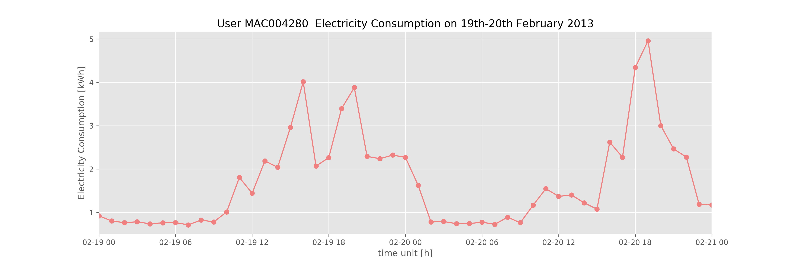

# Stranger things on Smart Energy
*Íngrid Munné Collado*

*Data Analytics June 2019*

## Content
- [Project Description](#project-description)
- [Hypotheses / Questions](#hypotheses-/-questions)
- [Dataset](#dataset)
- [Cleaning](#cleaning)
- [Analysis](#analysis)
- [Model Training and Evaluation](#model-training-and-evaluation)
- [Conclusion](#conclusion)
- [Future Work](#future-work)
- [Workflow](#workflow)
- [Organization](#organization)
- [Links](#links)

## 1. Project Description

We are every day much more aware of the consequences of the climate change. One of the objective to tackle climate change is to control and lower our electricity consumption. Moreover, we are trying to get rid of fossil fuel and run only with renewable energy resources. For this reason, several initiatives have emerged. 

Since 2009, there is a plan in Europe to install Smart Meters in each household and factory to meter their energy consumption in nearly real time. with time periods of 15 to 30 minutes. By doing this, the end-user can be much more aware of their energy consumption, but also the utilities can control fraud and provide personalized offers, tariffs and discounts to their portfolio. 

Hence, this is the idea of this project. By using data coming from London Data Store and from more than 5500 households' smart meters we want to analyze their energy consumption and understand the performance of time series variables, such as the electricity consumption. By meand of this project we want to understand this kind of data, as well as being able to answer some questions related to it. 

## 2. Hypotheses / Questions
The main questions we want to answer with this project are: 

- Can our electricity consumption be forecast? In this case, we would like to answer this question by predicting the electricity consumption of one household. 

- Can the electricity consumption explain something about ourselves as end-users? Can we be classified or clusterized in terms of our electricity consumption?

- Has the weather any relationship with the electricity consumption? If so, which are the most related parameters? 

All these questions are of interests when dealing with the integration of renewable energy sources and provide new services to end-users and electricity operators such as local energy and flexibility services. 

## 3. Dataset

In order to answer the questions presented above, as well as to prove the hypotheses, data has been retrieved. The datasets used in this project have been taken from different sources such as Kaggle, London Data Store and Dark Sky API, covering the time period between 2011 and 2014. The dataset structure is defined below: 

- **Smart Meters' measurements:** This data comes from London Data Store. It has been downloaded directly from the London Data Store. This dataset can be in two different formats. It contains more than 167 million of rows and a total size of 11,5 GB. For this reason, the entire dataset has been split into blocks, so as to be able to read and analyse with a normal computer. [Link to the dataset.](https://data.london.gov.uk/dataset/smartmeter-energy-use-data-in-london-households)  

- **Weather historical data:** This dataset has been extracted from Kaggle.com, on which the user Jean-Michel D. has complemented the Smart Meters Data with weather data in the same time period. This weather data has been retrieved from Dark Sky API and has been uploaded to Kaggle.  [Link to the dataset.](https://www.kaggle.com/jeanmidev/smart-meters-in-london)  

- **Accorn Classification:** The end-users classification is considered for each end-user according to their smart meter's measurements. The data comes also from London Data Store, but the explanation can be found in the link below and also to the CACI Report, a company specialist in providing Integrated Marketing, Location Planning Consultancy, Network Services and Technology Solutions. [Link to the CACI Report](https://acorn.caci.co.uk/downloads/Acorn-User-guide.pdf) 

The raw data downloaded has a total size of more than 11 GB. For this reason, it should be better to understand what this data tries to explain and how it is structured, in order to know which files will be used for the project and which not. In the folder 0.Data you will find a Codebook with different tables explaining each .csv file and the features included on each one. 

        Datasets that will be initially used for the project
        - information_households.csv
        - weather_hourly_darksky.csv
        - hhblock_dataset.zip : Block_12 
        - halfhourly_dataset.zip: Block_12 

## 4. Cleaning
Describe your full process of data wrangling and cleaning. Document why you chose to fill missing values, extract outliers, or create the variables you did, etc, as well as your thinking process.

The cleaning process of the dataset has been entirely in one *Jupyter Notebook* named *0_Data_Cleaning.ypnb* as it is described in the Organization section. It has been structured as follows: 

1. Dataset overview

    In this case, we are transforming object columns into *int* or *float* according to the feature we are measuring.

2. Handling Missing Values 

    When we are transforming object columns into datetime, we notice that there are missing values. In this case, since the timescale is 30', we are not taking into account missing values in timescales below 30' and we are dropping these values out of the dataset. 

3. DateTime columns transformation 

    When dealing with weather information or Electricity consumption data, we are working with DateTime objects and time periods. However, sometimes when we import the *csv*, this column is not considered as a DateTime object. Hence, we  should transform this data into DateTime. Furthermore, we should make sure that our DateTime column is sorted descendengly. 

4. Exporting tables into GoogleCloud 

    A GoogleCloud has been created to export the data into a SQL Database in order to have it centralized and with different connections between elements. 

_**This process has been done for each *csv* file used for the project.**_

## 5. Analysis

Once the data has been cleaned, and since this project deals with time-series, an important step before performing a ML model is to understand how the time-series looks like. This is also the idea of making user's dashboards where the end-user can see their energy consumption in different timeframes. When starting the project, the main hypotheses or assumptions that were taken into account were: 
 
 1. There are different patterns in terms of energy consumption depending on the time-period

 2. There are differences in energy consumption throughout the year. 

We can see that in Summer months the consumption is lower than in other periods. However, with time-series can be a little bit difficult to notice and for this reason moving averages will be calculated to see the trend of the consumption. 

 3. There are differences between users, but in general they follow the same patterns (high consumption during day and low consumption at night.)

  In the figure below, the energy consumption of user with ID MAC004280 is shown, and the pattern can be clearly seen. 

 4. There are two types of tariff that end-users have contracted and also, most users will have the Standard Tariff instead of the ToU tariff. 

## 6. Model Training and Evaluation

In this project two ML models have been developed. First of all, according to the first objective, a Time-Series Forecast model has been performed using SARIMA. Secondly, a Clustering on our clients' portfolio has been developed. 

### 6.1. Time - Series Forecast

A Time-Series ML Model has been developed using Time-series decomposition and SARIMA Models, from *sklearn* library. 

The initial step has been to analyse the autocorrelation, the seasonality and the stationarity of the data. To check the stationarity of the data, a Dickey-Fuller test has been performed. Most models in ML based on TimeSeries should ensure that the data is stationary to be able to be modeled by most algorithms in ML. Later on, the time-series signal has been decomposed into 3: Trend, seasonality and residuals. One of the most important challenges in TS is to decide the train and test, as well as the granularity of the signal to develop the model. 

A SARIMA model has been used to model the data. In this case, the train dataset has been daily data (total consumption per day), for 5 months in 2013. The test set has been 

### 6.2. Client Clustering 

sdkkjsdkfsdfk

## 7. Conclusion
* Summarize your results. What do they mean?
* What can you say about your hypotheses?
* Interpret your findings in terms of the human-understandable question you try to answer.

## 8. Future Work
Address any questions you were unable to answer, or any next steps or future extensions to your project.

## 9. Workflow

The workflow of the project can be split into three main parts: Data Acquisition and cleaning, Data Storing and Machine learning models, always based on the project's objective. In the figure below, a workflow diagram is shown to highlight the main steps of the project. 

## 10. Organization
Two main tools have been used to organize the project. Trello is a very useful tool to organize and manage all the tasks of the project. Github has been the second tool usd to mantain good practises when coding, being able to have a control of versions and upload all the project to the cloud. Last but not least, in order to understand the project, the Repository has been structured in folders as follows: 

0. **Data:**
    
    *raw_data* → Folder containing the raw data csv files coming from the resources mentioned in Section 3. 

    *cleaned_data* → Folder containgin the cleaned csv files obtained from *0_Data_Cleaning.ypnb* and  that will be used in the *1_Data_Analysis_ML_Model.ypnb* notebook.

     *This folder is not uploaded into the repository since it has a size of more than 11 GB of data. In case that you want to download the data, access to GoogleCloud Database can be shared with you to retrieve the data, please send me an e-mail at ingridmunne@gmail.com or by Github @wobniarin.*
    
1. **Jupyter Notebooks:**

    *1_Data_Cleaning.ypnb* → 

    *2_TimeSeries_Forecast.ypnb* → 

    *3_Dashboards_Clustering.ypnb* → 

2. **Resources:**

     Folder with all the pdf's containing useful information related to the topic of study in this project, such as clients classification. 

3. **Figures:** 
    
    Folder containing all the .png figures used for the presentation. 

4. **README markdown file:** 

    File that you are currently reading, with all the basic information about the project that has been carried out. 

5. **Codebook markdown file:**

    Markdown file where a detailed explanation of all the databases used, including the meaning of each feature as well as the units of each feature measurement. 

## Links

[Repository](https://github.com/wobniarin/Project-Week-8-Final-Project)  
[Slides](https://docs.google.com/presentation/d/1GSuSx_EbSJASnRWV_r75b__daAj41-HFUEzJgN3huU8/edit?usp=sharing)  
[Trello](https://trello.com/invite/b/5y6nfWDy/543abdc8bc9af930a5112f9e459fd7ca/project-5-final-project)  